
# Assignment 2: Exploring Fractals through Recursive Geometric Patterns

This repository contains the starter materials for **Assignment 2: Exploring Fractals through Recursive Geometric Patterns**.

---

## Table of Contents

- [Pseudo-Code](#pseudo-code)
- [Technical Explanation](#technical-explanation)
- [Geometric Influences](#geometric-influences)
- [Appearance Mapping](#appearance-mapping)
- [Parameters, seeds & results](#parameters--seeds)
- [References](#references)

---

## Pseudo-Code

1. **Define make_curve(start, end, curvature, direction)**
- Purpose: Create a smooth, curve between two points.
- how it works:
    - Compute the midpoint of the segment.
    - Calculate a perpendicular (normal) vector to the segment.
    - Offset the midpoint along this perpendicular by curvature × direction to define the control point of a quadratic Bezier curve.
    - interpolate points along the Bézier curve to form a Shapely LineString.
- why:
    - This replaces sharp, angular turns with smooth curves, allowing recursive dragon segments to flow organically while maintaining self-similar structure.

2. **Define generate_dragon(segment, depth, max_depth, angle_deg, scale_factor, turn_left, curvature, direction)**
    - Base Case:
        - If depth >= max_depth, append the current segment to line_list and exit recursion.
        - Stops the recursion to prevent infinite subdivision, while recording the segment for plotting.

    - Recursive Step:
        - Find midpoint of segment.
        - Rotate the segment by angle_deg (positive or negative depending on turn_left) -> defines the local branching angle of the fractal.
        - Scale the segment by scale_factor -> ensures self-similarity, shrinking each recursive iteration.
        - Split the transformed segment into two Bezier curves (a1, a2) -> preserves smooth curvature across recursive iterations.
        - Recursively call generate_dragon() on a1 and a2 -> alternating turn directions and flipping curvature ensures symmetry and maintains fractal integrity.
    - why:
        -Each recursive call creates a smaller, rotated, and curved segment that contributes to the overall dragon pattern. The alternating directions create the classic “folded paper” appearance.

3. **Define generate_golden_ratio_dragon(x1, y1, x2, y2, turn, n, points)**
    - Purpose:
        - Generate a dragon curve based on φ (golden ratio) rather than simple rational angles.
    - How it works:
        - Compute subdivision ratios using φ: r = (1 / φ)^(1 / φ), with r1 = r, r2 = r².
        - Calculate rotation angles (θ1, θ2) from the cosine law using these ratios -> ensures irrational yet self-similar subdivisions.
        - Determine the next subdivision point based on distance, ratio, and angle.
        - Recurse on each sub-segment with alternating turns -> builds the full φ-based fractal structure.
    - why:
        - Using φ-based ratios avoids exact repetition, creating quasi-crystalline, aesthetically complex structures that differ from standard Heighway dragons.

4. **Define morph_dragon(segment, depth, max_depth, morph, curvature, direction)**
    - Purpose: 
        - Interpolate between Heighway (Orthogonal) and Golden Ratio dragons for intermediate fractal forms.
    - how it works:
        - Use morph (0 = Heighway, 1 = φ-dragon) to interpolate:
            - angle_deg = 90 x (1 - m) + θ φ x m
            - scale_factor = 1.0 × (1 - m) + φ⁻¹/φ × m
        - Uses a nonlinear ease-in curve (morph**1.5) for smooth transition.
        - Call generate_dragon() with these blended parameters.
    - Why:
        - Allows exploration of the continuous spectrum of dragon shapes, demonstrating how small parameter changes can produce drastically different global patterns.

5. **Define plot_dragon(max_depth, dragon_type, curvature, figsize, segment_subdiv, morph)**
    - Collects all segments into a unified list.
    - Applies gradient coloring along cumulative curve length.
    - Scales and renders the result using Matplotlib.
    - Save output as images/{dragon_type}_depth{n}_morph{morph}_curv{curvature}.png.

6. **Main Execution**
start, end = (0, 0), (100, 0)
segment = LineString([start, end])
morph = 0.0  # 0 = Heighway, 1 = Golden Ratio, 1 < other "dragon" curves
max_depth = 10
curvature = 0
    - Depending on dragon_type, call:
        - generate_golden_ratio_dragon() for φ-dragon.
        - generate_dragon() for Heighway/Terdragon.
        - morph_dragon() for interpolated morph.
        - Plot and save results via plot_dragon().

## Technical Explanation

This script generates a family of recursive dragon curves that continuously morph between the Heighway Dragon (orthogonal at morph = 0) and the Golden Ratio Dragon (φ-scaled with an irrational rotation at morph = 1). As the morph value moves beyond 1, new variations start to appear, showing how the same recursive system can produce an extended range of dragon geometries.  

Recursion Logic:
Each segment is divided into two smaller ones, rotated and scaled around their midpoint. This recursive process builds a structure where every generation follows the same transformation rule, creating a layered, branching pattern that grows in complexity with each iteration.

Geometric Foundations:
- Heighway Dragon: rotation = 90°, scale = 1.0.
- Golden Ratio Dragon: rotation derived from φ-based cosine law; scale = φ⁻¹/φ.
- Morphing: nonlinear interpolation (morph**1.5) between the two parameter sets.
- Curvature: introduces quadratic Bezier deformation, replacing rigid turns with softer, more continuous flow

The system relies on Shapely for precise geometric transformations and Matplotlib for rendering. Together, they make it possible to explore the transition between rational and irrational recursive systems as both a visual and mathematical study of form.

## Geometric Influences

Golden Ratio Scaling Influence (φ-field)
- The recursion geometry is directly modulated by φ ≈ 1.618.
- The subdivision ratio and rotation angles are derived from the golden ratio using trigonometric relationships, creating   self-similar growth governed by irrational proportions.

Curvature Field
- Bezier-based curvature modifies each segment’s local geometry.
- Controlled by a signed curvature × direction, producing alternating bulges.
- When curvature > 0, the dragon becomes organic and fluid; when 0, it becomes polygonal and crystalline.

## Appearance Mapping

Color Gradient:
The line color is mapped to normalized cumulative curve length (mids), using a gradient from lime -> cyan -> violet (#9be64a, #2dd2e5, #6b4be8). Represents progression through recursive space, visually encoding time or iteration sequence.

Line Width:
Width inversely scales with mids (linewidth = 1.6*(1 - mids) + 0.1) so early recursion segments appear thicker, giving a visual hierarchy of depth.

Background:
Black background emphasizes chromatic contrast, reinforcing the fractal’s luminous, energetic nature.

## Parameters, seeds & results

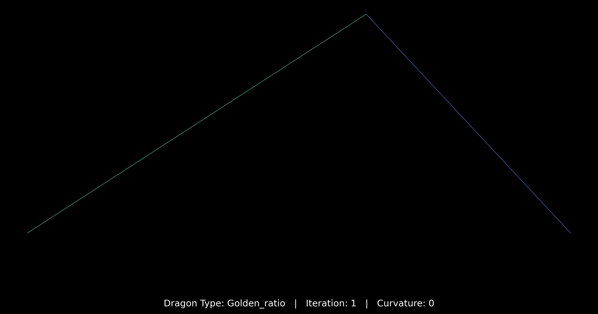
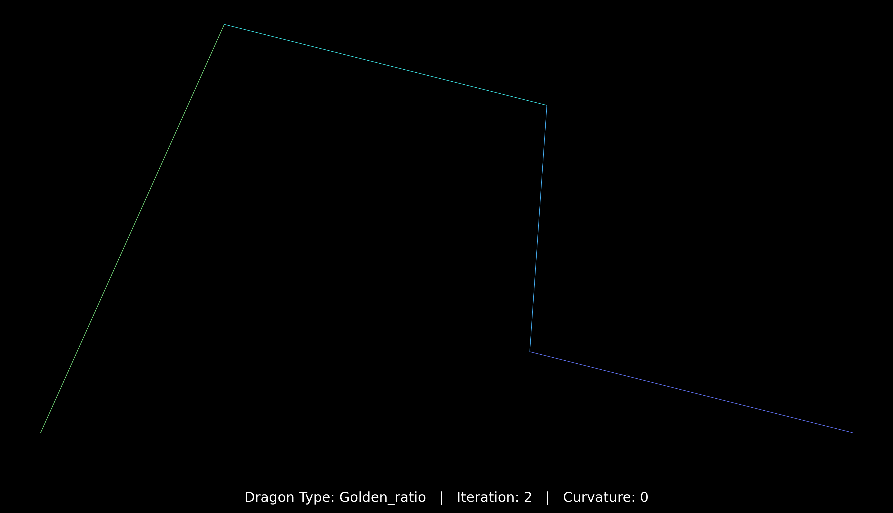
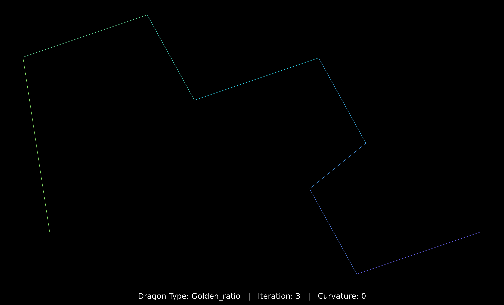
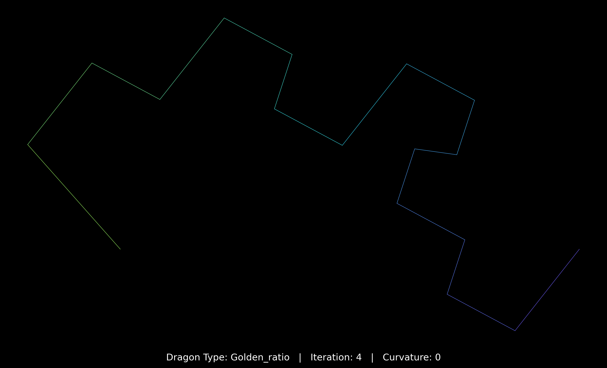
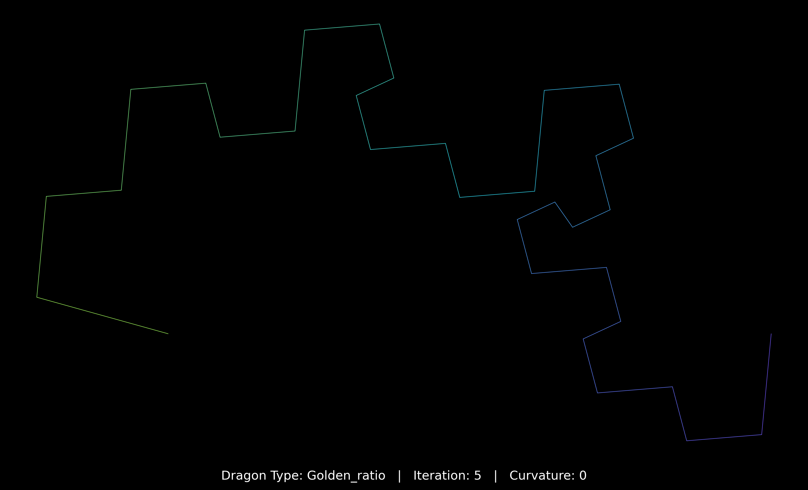
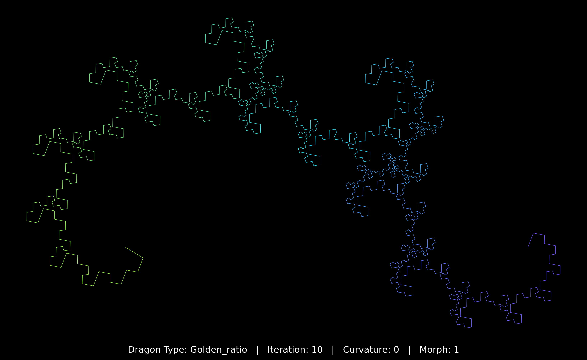
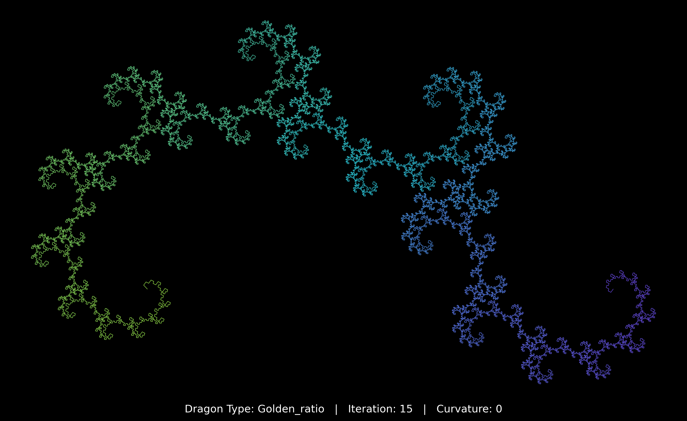
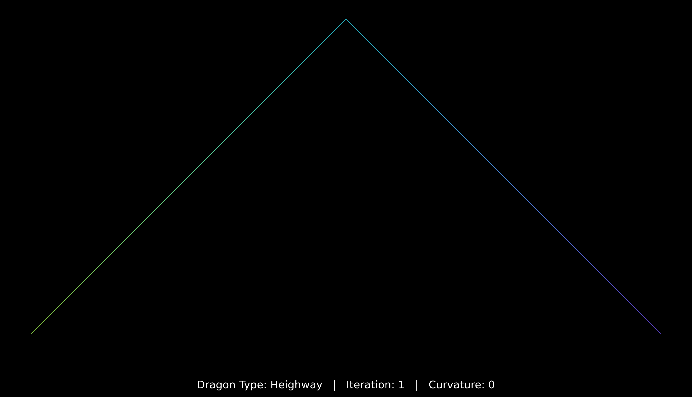
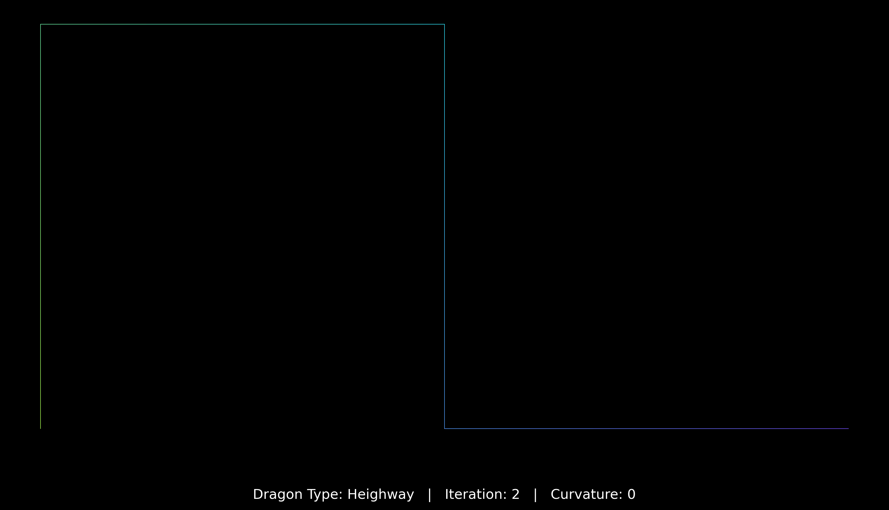
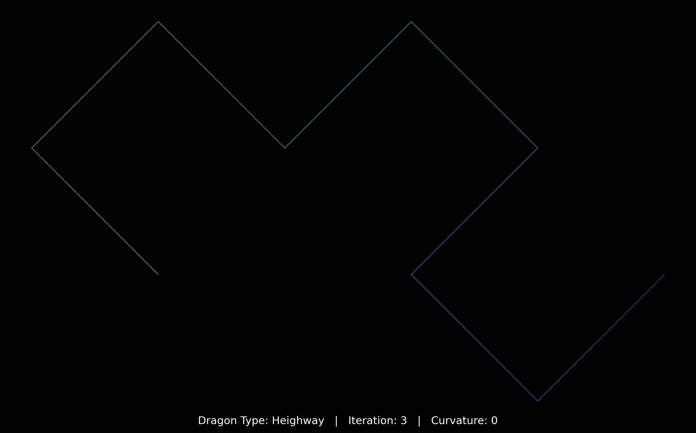
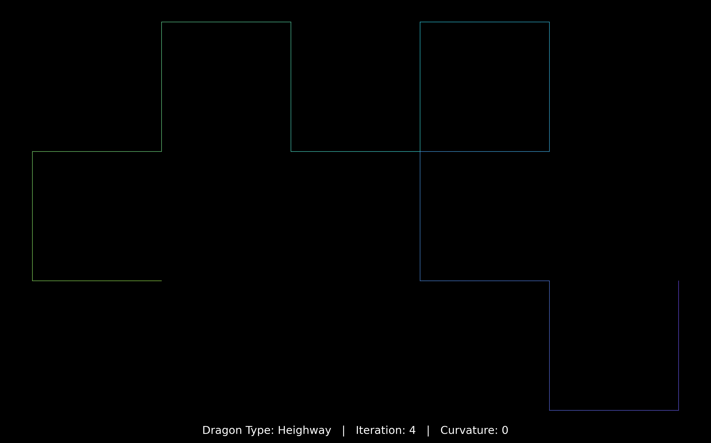

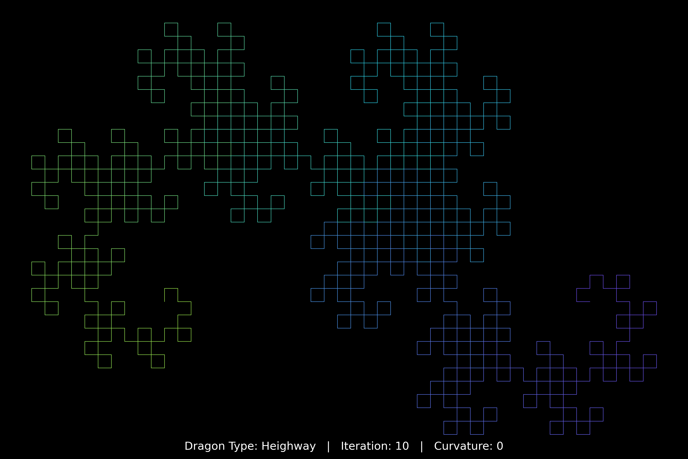
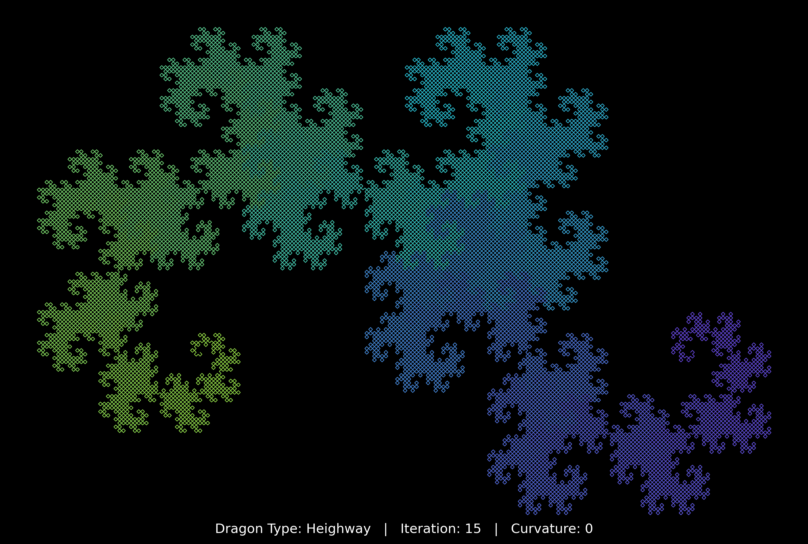
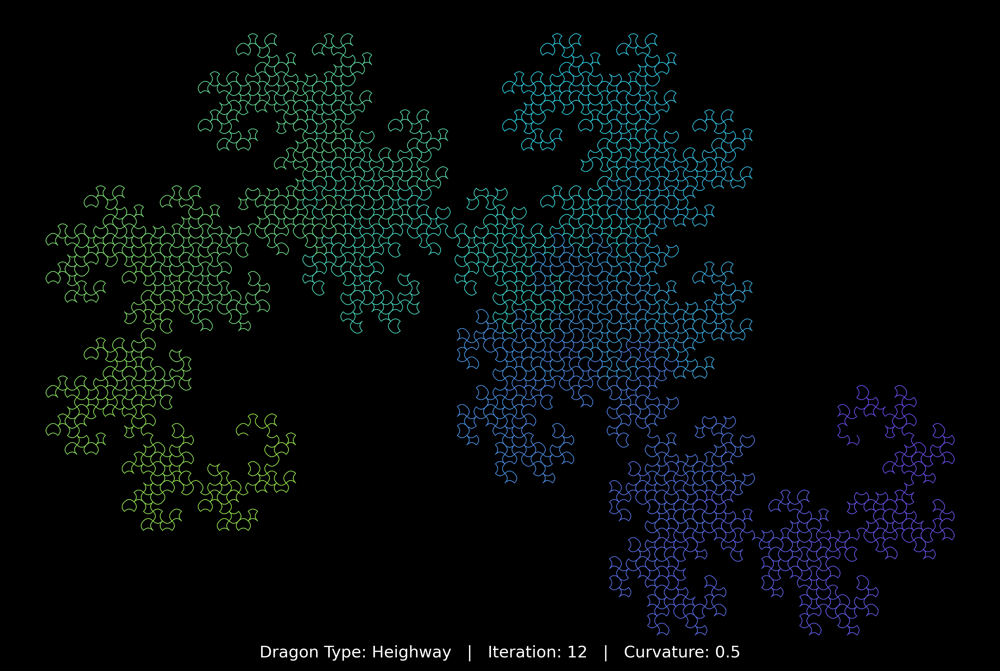

These images show the Dragon Curve, kinda like a fractal created by folding a strip of paper. By changing the fold angles (morph), you can see how the pattern evolves and transforms. It’s a way to explore how simple rules can generate complex shapes.

## Challenges and Solutions

Early versions showed only one color since recursion depth wasn’t linked to color mapping.
Fix: Color was mapped to the cumulative segment length, creating a smooth gradient (green -> blue -> purple) that reveals depth and flow through the fractal.

Blending the Heighway and Golden Ratio dragons was difficult because they follow different geometric rules (rotation and scaling).
Fix: Created a dedicated morph_dragon() function that calculates blended angle and scale factors using the Golden Ratio as reference. This enabled a smooth geometric transition between distinct fractal types.

High iterations caused overlapping lines, visual noise, and slow rendering.
Fix: Used LineCollection for performance, variable linewidths for depth perception, and segment subdivision for smoother detail at deeper iterations.

## References
https://www.youtube.com/watch?v=BUWeBtgfdJk
https://www.youtube.com/watch?v=0CeQVvvX9os
https://github.com/Michael-Naguib/Chaotic-IFS-Fractal/blob/master/screenshots/gd1.PNG
https://pythonturtle.academy/golden-dragon-curve-fractal-source-code/
https://larryriddle.agnesscott.org/ifs/heighway/terdragon.htm
https://larryriddle.agnesscott.org/ifs/heighway/goldenDragon.htm
https://stackoverflow.com/questions/765048/drawing-a-dragons-curve-in-python
http://www.fractalcurves.com/Root7.html
https://micahtillman.com/flowerdragon/

