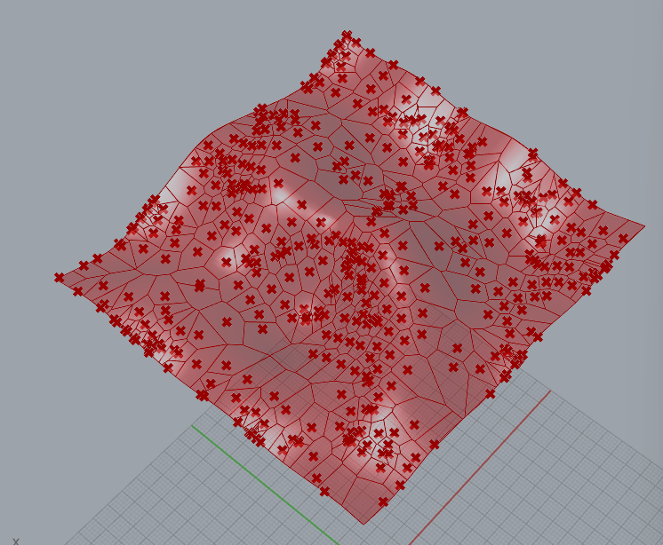
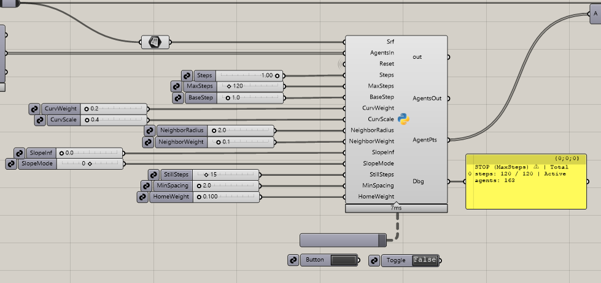
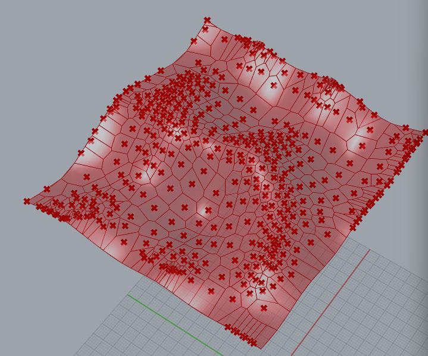
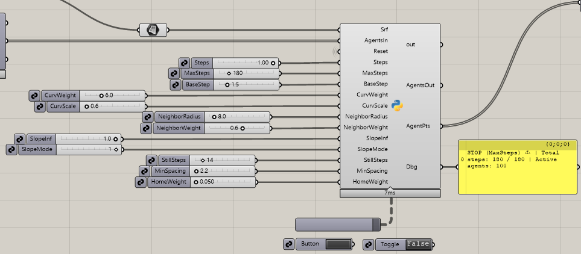
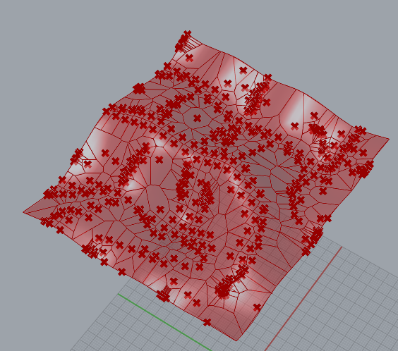
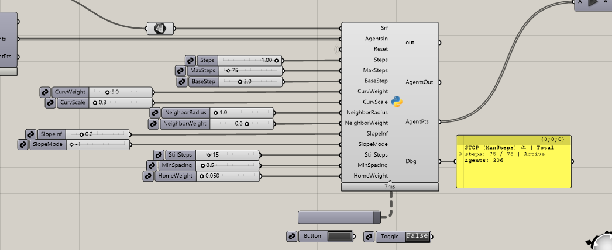

# Assignment 4: Agent-Based Modeling for Surface Panelization

## Table of Contents

- [Project Overview](#project-overview)
- [Pseudo-Code](#pseudo-code)
- [Technical Explanation](#technical-explanation)
- [Design Variations](#design-variations)
- [Challenges and Solutions](#challenges-and-solutions)
- [AI Acknowledgments](#ai-acknowledgments)
- [References](#references)

---

## Project Overview

This project begins with a heightmap-generated NURBS surface populated by agents placed on a UV-indexed grid. Each agent stores its parametric position and a “home” location, giving it freedom to move across the surface while staying loosely anchored to its initial grid layout.

Agent behavior is controlled by two geometric signals:
- Principal curvature direction - aligns movement with ridges and valleys.
- Slope influence — pushes agents downhill or uphill depending on the mode.

These signals combine to create differentiated flow on the surface. Neighbor-repulsion prevents overcrowding, while a soft home-spring stabilizes the distribution.

The panelization strategy is a UV-domain Voronoi tessellation:
Final agent positions are projected to UV space, used as Voronoi seeds, clipped to the surface domain, and then mapped back into 3D. This produces free-form cells that adapt to both surface geometry and agent motion.

The agents generate patterns such as clusters in depressions, alignment along curvature flows, and directional drift driven by slope. These behaviors produce Voronoi regions that stretch, compress, or bend according to the underlying surface geometry, resulting in a panelization that visually expresses the shape and forces within the surface.

## Pseudo-Code

### 1. Surface Generation (Heightmap → NURBS Surface)

Purpose:
Create a smooth, manipulable surface from a closed outline using a Perlin-noise heightmap.

How it works:
- Sample a regular (U×V) grid inside the boundary curve.
- For every sample, compute:
    - Whether it lies inside the boundary.
    - Distance to the curve → used for falloff.
    - Perlin noise value at that UV coordinate.
    - Combine noise × amplitude × falloff + height offset (H).
    - Convert all samples to 3D points.
    - Build a NURBS surface from this grid.

Why:
The system needs a continuous differentiable surface so curvature directions and slope can be computed everywhere.

### 2. Agent Initialization (UV-Indexed Grid)

Purpose:
Create a stable parametric grid of agents evenly distributed over the surface.

How it works:
- Input: list of structured points (from the surface generator).
- For each point:
    - Find UV coordinates using ClosestPoint.
    - Assign grid index (i, j) based on its list position.
- Store:
    - Parametric position (u, v)
    - Original home position (u0, v0)
    - 3D surface point
    - State information (active, still_steps)

Why:
This keeps the agent layout consistent across the simulation and guarantees a predictable topology for the panelization step.

### 3. Geometric Signal Evaluation

#### A. Curvature Field (Scalar + Directional)

Compute principal curvature at (u, v).
  - Extract:
    - Curvature magnitude → used to slow movement.
    - Principal curvature direction → used to steer movement.

Why:
Agents "follow" the geometry and react differently depending on surface bending.

#### B. Slope Field (Up/Downhill Direction)

Sample local height change by moving slightly in +u and +v.

Build an uphill vector in tangent space.

Optional influence:
- Uphill (positive)
- Downhill (negative)

Blended with curvature direction using slopeInf ∈ [0,1].

Why:
This adds a controllable secondary behavior: gravity-like movement or its inversion.

### 4. Movement Logic per Agent

Purpose:
Update each agent based on signals and constraints.

How it works:

1. Sense signals
    - curvature magnitude
    - curvature direction
    - optional slope direction

2. Compute movement direction
    - base direction = curvature direction
    - if slopeInf > 0:
      - blend curvature direction with slope direction (1–slopeInf)*curv + slopeInf*(slopeMode*slope)

3. Adjust speed with curvature
    - higher curvature → slower movement
    - prevents agents sliding into unstable high-curvature zones

4. Neighbor spacing
    - if another agent is within radius:
    - push away with weighted repulsion

5. Home spring
    - soft attraction back to home UV
    - prevents the grid from collapsing or drifting

6. Convergence rule
    - if an agent stays above MinSpacing for multiple steps:
      - mark as inactive (finished)

7. Project onto surface
    - compute new 3D point → get new (u, v) using ClosestPoint
    - update agent position

Why:
This produces controlled, geometry-aware movement while preventing overlap, divergence, or collapse.

### 5. Simulation Loop

Purpose:
Evolve all agents until spacing is achieved.

How it works:
- If reset is pressed → reload agent list.
- Otherwise → continue from sticky memory.

For each step:
- Update every active agent.
- Count active agents.
- Stop early if all agents are inactive.
- Also stop if MaxSteps is reached.

Why:
The simulation behaves like a time-based system with persistent state across Grasshopper recomputations.

### 6. Panelization (Voronoi in UV Space)

Purpose:
Convert the final agent positions into a tessellation.

How it works:
- Map final agent points → UV.
- Create a bounding box polygon in UV domain.

For each site:
- Start with the full box.
- Clip against all perpendicular bisectors.
- Result = Voronoi cell polygon.
- Map UV polygon → 3D surface.

Output:
- cell curves
- cell centers

Why:
Voronoi is directly sensitive to point distribution, so agent movement shapes the final panels.

### 7. Outputs

AgentPts -  final relaxed positions.

AgentOut -  full agent state (for debugging).

Voronoi cells - panelization geometry.

Centers - cell anchor points.

Debug string - simulation status.

## Technical Explanation

The project follows a staged computational pipeline.
First, a Perlin-noise heightmap is generated within a closed boundary curve, producing a smooth NURBS surface. Next, geometric signals—principal curvature and slope—are sampled directly from this surface during simulation. Agents are then initialized across the surface as a structured UV grid, each storing both its parametric coordinates and 3D point. The agent_simulator.py module updates these agents over time through weighted geometric signals and interaction rules until they reach a stable configuration. Finally, the relaxed agent positions are used as seed sites for surface-mapped Voronoi panelization.

### 1. Overall Pipeline

This project consists of a complete computational pipeline linking surface generation, geometric signal extraction, agent-based simulation, and final panelization.

1. Surface Generation (surface_generator.py)
- A Perlin-noise heightmap is sampled inside a boundary curve to produce a structured (U×V) grid of points. These points are lofted into a differentiable NURBS surface.

2. Field / Signal Computation
- During simulation, agents locally sample geometric signals directly from the surface:
    - Principal curvature magnitude + direction
    - Local slope (uphill/downhill direction)

3. Agent Initialization (agent_builder.py)
- Points from the generated surface are mapped into UV space, indexed in a consistent (i, j) grid, and converted into agents with:
    - Parametric coordinates
    - 3D positions
    - Home UV positions
    - Persistent state variables

4. Agent Simulation (agent_simulator.py)
- At each time step, agents sense curvature and slope, blend directional influences, repel neighbors, and follow a convergence rule. Movement is always projected back onto the surface.

5. Panelization (Voronoi-based)
- Final agent positions are used as Voronoi seeds in UV space. Each UV Voronoi cell is clipped, mapped back to 3D, and output as surface-fitted panels.

### 2. Surface Generation and Fields
The surface originates from a heightmap constructed via Perlin noise, modulated by a soft distance to boundary falloff. This ensures smooth gradients and avoids artefacts near the edges. The resulting NURBS surface has a consistent UV domain, which is important because agents rely on parametric coordinates for both movement and field evaluation.

Geometric signals are sampled directly from the surface as needed rather than precomputed. Principal curvature direction and magnitude are obtained using RhinoCommon’s curvature evaluator. Slope is approximated by sampling small UV offsets, comparing height changes, and constructing a local uphill direction. These signals are consumed in the simulation as 3D vectors, normalized and suitable for blending into a single motion field.

Agents determine which part of the field they occupy by using their (u, v) coordinates. Since the UV domain is continuous, no discrete array indexing is required. Each signal is sampled directly from the surface at the agent’s exact location.

### 3. Geometric Signals and Agent Behaviors
Two key geometric signals govern agent motion:

Curvature field
- Agents align their movement with the direction of maximum principal curvature. This gives a “flow-along-the-surface” behavior. Curvature magnitude affects speed: high curvature reduces step length, causing agents to slow down in sharply bending regions.

Slope field
- A slope sampling function approximates the local uphill vector. Depending on user-defined weights, agents can shift their motion toward downhill flow, uphill flow, or remain unaffected. This influence is blended with curvature direction using a weighted linear combination, letting agents move according to hybrid geometric tendencies.

Agents may also exert forces on each other: a repulsion term prevents overcrowding, and a spring force pulls them gently toward their initial UV positions. These behavioral components interact with geometric signals to produce coherent yet varied surface flows.

### 4. Agent Life-Cycle and Interactions
Each agent tracks whether it is active. After every move, it evaluates its nearest neighbor distance. If it maintains a spacing above a given threshold for several consecutive steps, it becomes inactive. This prevents unnecessary computation once local equilibrium is reached.

Interaction rules include:
- Neighbor Repulsion: Ensures even spacing and prevents overlaps.
- Home-Spring Force: Gently keeps agents from drifting too far from their original grid placement, maintaining overall structure.
- Activity Thresholding: Agents self-terminate when they reach stable spacing.

No spawning or deletion events occur; the model maintains a fixed population but alters their states and positions over time.

### 5. Simulation and Panelization Strategy
The simulation runs in discrete steps until all agents become inactive or a global step limit is reached. Each step computes geometric signals, determines motion, applies interactions, updates UV positions, and projects agents back onto the surface.

The final panelization uses the converged agent positions as Voronoi generator points. Voronoi cells are computed in UV space using half-plane clipping, then mapped back into 3D by evaluating each polygon vertex on the surface. This creates a curvature-aware panelization: areas with stronger curvature or heavier slope influence lead to asymmetric or stretched cells, while flatter regions maintain more uniform patterns.

### 6. Multi-Module Design
The system is organized into three main modules:
- surface_generator.py builds the surface using noise-based heightmap logic.
- agent_builder.py initializes agents, computes their UV coordinates, and assigns structured indexing.
- agent_simulator.py handles geometric signal sampling, agent motion rules, neighbor interactions, convergence logic, and output state.

The Voronoi generator is implemented as a separate Grasshopper Python component. This module structure improves clarity, isolating responsibilities: surface creation, agent lifecycle management, and final geometry generation remain independent but connected through shared data structures.

Why modularity?
- Each part can be improved independently
- Simulation stays clean and readable
- Reusable components (surface, agents, fields) for future assignments
- Clear conceptual separation matching the assignment rubric

## Design Variations

### Parameter and Signal Table

This table summarizes all parameters used in the agent-based model, what they control, and how they influence the system. It also explains the geometric signals the agents read from the surface.

| Parameter                  | Type    | Typical Range | Description                                                | Effect on Behavior                                                  |
| -------------------------- | ------- | ------------- | ---------------------------------------------------------- | ------------------------------------------------------------------- |
| **Steps**                  | Integer | 1–5           | How many internal simulation steps to run per GH trigger.  | Higher = faster simulation, less visual control.                    |
| **MaxSteps**               | Integer | 20–200        | Global limit before simulation auto-stops.                 | Safety cap; prevents infinite loops.                                |
| **BaseStep**               | Float   | 0.05–1.0      | Base movement distance per step.                           | Larger = agents travel farther and respond more dramatically.       |
| **CurvWeight**             | Float   | 0–1           | Weight of curvature slowing effect.                        | 0 = ignore curvature speed; 1 = slow down strongly in curved zones. |
| **CurvScale**              | Float   | 0.05–5        | Normalization for curvature values.                        | Lower = curvature feels “stronger”; movement slows sooner.          |
| **NeighborRadius**         | Float   | 0–10          | Detection radius for nearby agents.                        | Larger radius = more spacing awareness.                             |
| **NeighborWeight**         | Float   | 0–1           | Repulsion strength between neighbors.                      | 0 = no repulsion; 1 = strong spacing force.                         |
| **MinSpacing**             | Float   | 0.1–5         | Minimum allowed distance between agents.                   | Controls how far apart points settle.                               |
| **StillSteps**             | Integer | 2–15          | Steps in a row where spacing is satisfied before stopping. | Larger value = stricter convergence requirement.                    |
| **HomeWeight**             | Float   | 0–1           | Spring force pulling agent back to original UV position.   | 0 = no tether; 1 = strong return force—keeps order.                 |
| **SlopeInf** *(optional)*  | Float   | 0–1           | Blending amount for slope direction.                       | 0 = off; 1 = full slope-based movement.                             |
| **SlopeMode** *(optional)* | Float   | –1 to +1      | Direction of slope movement.                               | –1 = downhill, 0 = off, +1 = uphill.                                |
| **Reset**                  | Boolean | —             | Reinitializes agent positions and clears sticky memory.    | Ensures clean start for a new simulation.                           |

| Output                                | Type                  | Description                                                                              |
| ------------------------------------- | --------------------- | ---------------------------------------------------------------------------------------- |
| **AgentsOut**                         | List of Agent objects | Full agent state (UV + 3D + activity + memory). Used internally for next steps.          |
| **AgentPts**                          | List of Point3d       | The current 3D positions of all agents, used for visualization and panelization.         |
| **Done**                              | Boolean               | True when all agents have become inactive (i.e., spacing + movement criteria satisfied). |
| **Dbg**                               | String                | Debug message showing step count, active agents, and convergence info.                   |
| **UCurves** *(optional panelization)* | List of Curves        | Interpolated curves connecting agents across U-rows.                                     |
| **VCurves** *(optional panelization)* | List of Curves        | Interpolated curves connecting agents across V-columns.                                  |
| **Panels** *(optional panelization)*  | List of Breps         | Quad panels generated from the reorganized grid.                                         |

### Variation 1: [Curvature-Flow Relaxation]

- **Signals Used**:
    - Principal curvature direction field (vector signal)
    - Curvature magnitude field (scalar signal)
    - Neighborhood spacing (geometric signal)

- **Parameters Changed**:

- **Description**:
    - In this variation, agents drift gently along the surface’s principal curvature directions. Curvature magnitude slows agents down in highly curved regions, producing tighter density around bumps and relaxed spacing across flatter zones. A light neighborhood repulsion keeps agents from clustering without overpowering the curvature-driven drift.

### Variation 2: [Curvature-Slope Flow Field]

- **Signals Used**:
    - principal curvature direction
    - slope direction
    - curvature magnitude field
    - neighborhood spacing

- **Parameters Changed**:

- **Description**:
    -     - Agents stop behaving like a grid and instead move like particles sliding over the surface. Curvature pulls them along bending directions while slope pushes them uphill, producing directional streaks, dense clusters.

### Variation 3: [Name/Description]

- **Signals Used**:
    - curvature field + reverse slope influence

- **Parameters Changed**:

- **Description**:
    - This variation emphasizes unpredictable, turbulent motion by combining strong curvature following with a reverse-slope attractor. Agents accelerate across the surface with minimal stabilization, creating dense pockets, stretched voids, and rapidly shifting local neighborhoods.

## Challenges and Solutions

**Challenge 1 — Agents collapsing into the same direction / not moving enough**

Problem:
Early versions of the agent system caused many points to drift toward the same region, especially when neighbor forces were low. In some parameter ranges, agents barely moved at all or immediately converged and stopped.

Diagnosis:
By visualizing curvature fields and testing flat surfaces, I discovered that using only principal curvature direction wasn’t enough. It becomes near-zero in flat or mildly curved areas. Also, step sizes were too small relative to the surface scale (112×112 mm).

Solution:
I introduced SlopeInf / SlopeMode as a secondary directional signal and increased BaseStep, allowing agents to move even in low curvature. Tuning MinSpacing and StillSteps prevented premature stopping and allowed more expressive motion.

**Challenge 2 — Uneven spacing and excessive clustering**

Problem:
Agents clustered too tightly in low areas or at curvature seams, creating unwanted density spikes that broke panelization later.

Diagnosis:
By monitoring nearest-neighbor distances and visualizing the iteration steps, I realized the NeighborRadius and NeighborWeight were too low to counteract curvature attraction. HomeWeight also occasionally pulled agents back into crowded positions.

Solution:
I increased the repulsion radius/strength and reduced home pull for dynamic variations. This gave agents enough “personal space,” resulting in more even distributions and cleaner Voronoi/quad panels.

**Challenge 3 — Panelization failing (empty outputs, gaps, distorted quads)**

Problem:
Quad panelization produced missing panels or heavily twisted ones when agents drifted off-grid or lost their original UV coordinates.

Diagnosis:
The issue came from agents created without stored i / j grid indices, making rows and columns impossible to reconstruct. Some agents also moved too far, breaking the neighbor structure.

Solution:
I rebuilt the agent-builder so every agent retains a stable UV location + (i, j) index from the start. This allowed consistent remapping back into a grid. For Voronoi paneling, I switched to a UV-domain clipping method, ensuring every cell remains well-formed even after large agent movements.

## AI Acknowledgments

The whole chat can be read here: https://chatgpt.com/share/69373147-8178-8007-8aab-ed7387fdec57